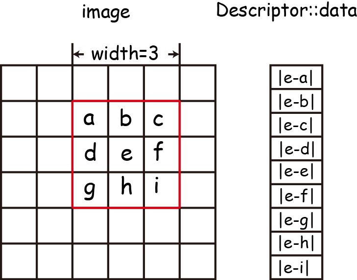

## 从头构建自己的数字图像算法库——MyTinyImg
我们经常使用各种库——或许是如OpenCV等专门用于图像处理的库，或许是在写UI界面、视频处理、3D建模等功能时，所引用的库有一定的图像处理功能。既然我们具有一定的数字图像处理与数字摄影测量学的知识，为什么我们不**从最底层**开始，尝试实现各种课程上所提及的算法呢？作为这门课程的作业，你将在我们给定的框架下补充代码，实现各种图像处理的功能，包括：
* 图像基本操作
* 图像重采样与resize (⭐⭐)
* 图像卷积操作与各种卷积核 (⭐⭐⭐)
* Harris角点提取与特征描述 (⭐⭐⭐⭐)
* 基本的暴力匹配策略与RANSAC (⭐⭐⭐⭐⭐)
* ...
  
当然，你也可以为MyTinyImg做可能的功能扩展，但是这**并不会**影响你的分数，但会对你巩固已有知识起到促进作用。

#### 0. 环境配置
本项目基于 C++ 语言编写，使用的语言特性**不超过** C++11。项目文件结构如下所示
```
MyTinyImg
├── build -- CMake 生成目录
├── CMakeLists.txt
├── data -- 测试数据存放位置
├── lib -- 静态库与动态库生成位置
├── output -- 程序输出文件存放位置
├── sample
└── src -- 源代码
    ├── image_base_operation.cpp  -- 一些图像的基本操作
    ├── image_filter.cpp -- 卷积操作与滤波器
    ├── image.h -- 类与函数的定义
    ├── image_harris_corner.cpp -- Harris 角点提取与描述
    ├── image_load_save.cpp -- 图像存取
    ├── image_match.cpp -- 图像匹配
    ├── image_resample.cpp -- 图像重采样与resize
    ├── matrix.cpp -- 所需矩阵操作实现(用于RANSAC计算单应矩阵)
    ├── matrix.h -- 矩阵操作定义
    ├── stb_image.h
    ├── stb_image_write.h
    └── test
        └── test.cpp
```
代码可以在 Linux 或 Windows 环境下用 CMake 编译运行。在 Linux 环境下，你可以执行
```
sudo apt-get install cmake
```
安装cmake，然后在 MyTinyImg 目录下执行
```
cd build
cmake ..
make
```
最后执行
```
cd ..
./test
```
来执行编译得到的 test 程序进行测试。
在 Windows 系统你可以使用 Visual Studio Code 或 Visual Studio 配置 CMake 达到类似的效果。

#### 1. 文件与接口
##### 文件
我们为你实现了基本的 `Image` 类与一些基本功能，而另外一些函数只提供了声明，并未实现。你需要分别在四个文件中实现它们作为成果上交。我们将在一台 Linux 机器上编译运行你的程序，进行一些简单测试作为成绩的参考。这四个文件包括:
* `image_resample.cpp`：图像重采样与改变大小
* `image_filter.cpp`：图像卷积与滤波器实现
* `image_harris_corner.cpp`：Harris角点提取与特征描述
* `image_match.cpp`：图像匹配与RANSAC
  
你也可以修改 `test/test.cpp` 文件进行自己的测试。后两个任务难度显著高于前两个任务，并需要调用前两个（尤其是卷积与滤波器）任务所实现的函数。请酌情分配人数与时间。

在上述的 4 个文件开头，将会有如下注释内容：
```C++
// Fill your student ID and name bellow, so that we 
// can check your contribution in group
// Modified By:
// Seq      Student ID      Name            Note
// 1.       1234567         Zhang Yunlong
// 2.
```
你需要在你完成的对应文件内填写你的学号、姓名，一边我们可以确定组内分工情况。如学号为 2150000 的学生张三与学号为 2151111 的学生李四共同完成了 `image_match.cpp` 的填写，则可填写为：
```C++
// Modified By:
// Seq      Student ID      Name            Note
// 1.       1234567         Zhang Yunlong
// 2.       2150000         Zhang San
// 3.       2151111         Li Si
```
如有特殊情况，填写在最后的备注栏。

最后请将上述 4 个文件放到一个名字为组号的文件夹内，其结构如下：
```
1 -- 组号
├── image_filter.cpp
├── image_harris_corner.cpp
├── image_match.cpp
└── image_resample.cpp
```
请将之打包为一个 `zip` 文件，名字仍为组号，由组长上交。
你也可以在文件夹内加入其他文档为你组工作进行任何补充说明。

##### 接口
对于存取图像操作，我们使用 C/C++ 库 stb (https://github.com/nothings/stb)。该库在头文件中给出了实现，无需编译即可使用。


###### 图像存储结构
图像以一个一维 `double` 数组存储，对于任意图像均将其像素归算到 `[0,1]` 范围内（例如对于典型的8位图像，我们将对所有像素值除以255进行存储）。图像以所谓 `HWC` 格式存储，先将每个像素的各个通道按序存储，然后按行顺序存储，最后按列顺序存储，如下图所示。注意 x 与 y 轴设置：如果以行列表示，x 表示列序号，y 表示行序号。各个序号均从 0 开始。


对于 `Image` 类，你可以做以下类似操作。
###### 初始化图像
```C++
#include "image.h"

// 默认初始化：0*0 图像
Image image1;

// 使用宽、高初始化灰度图像
Image image2(5,5);

// 使用宽、高与通道数初始化多通道图像
Image image3(5,5,3);
```
###### 读取图像
使用`Image::load`或`loadImage`读取图像
```C++
#include "image.h"

// 使用loadImage
Image image1 = loadImage("data/house.jpg");

// 使用Image::load
Image image2;
image2.load("data/house.jpg");
```
###### 保存图像
使用 `Image::save` 或 `saveImage` 保存图像
```C++
#include "image.h"

Image image = loadImage("data/house.jpg");

// 使用saveImage
saveImage("output/house_copy_1.jpg", image);
// 使用Image::save
image.save("output/house_copy_1.jpg");
```

###### 访问图像宽、高与通道数
```C++
#include "image.h"

Image image = loadImage("data/house.jpg");

// 图像宽度
int w = image.width();

// 图像高度
int h = image.height();

// 图像通道数
int c = image.nChannel();
```
###### 像素访问
```C++
#include "image.h"

Image image = loadImage("data/house.jpg");
// 访问坐标 (1,3) 处第二个通道的像素值
double pixelVal = image(1,3,2);
```
###### 钳位像素访问
```C++
#include "image.h"

Image image = loadImage("data/house.jpg");
// 访问坐标 (0,0) 处第二个通道的像素值
// Image::clapmedPixel 将所有超过边界的坐标值归算到边界上
// 返回为 (0,0,2) 处的像素值
double pixelVal = image.clampedPixel(-3,-1,2);
```
###### 设置像素
```C++
#include "image.h"

Image image = loadImage("data/house.jpg");

// 使用 Image::setPixel 将坐标 (1,2) 处第1个通道的值设置为0.1. 
// 坐标越界时将直接返回
image.setPixel(1,2,1,0.1);

// 使用 () 运算符设置，坐标越界将报错
image(1,2,1) = 0.1;
```

###### rgb图像与灰度图像转换
```C++
#include "image.h"

Image image = loadImage("data/house.jpg");

// rgb 转灰度图像
if(image.nChannel() == 3)
    image = rgb2gray();
```
#### 2. 图像重采样
在 `image_resample.cpp` 中，完成以下 6 个函数：
```C++
#include "image.h"
double Image::pixelNearest(double x, double y, int c) const;
double Image::pixelBilinear(double x, double y, int c) const;
double Image::pixelBicubic(double x, double y, int c) const;

Image nearestResize(Image const& image, int width, int height);
Image bilinearResize(Image const& image, int width, int height);
Image bicubicResize(Image const& image, int width, int height);
```
其中，前三个函数获得非整数坐标 `(x,y)` 处第 `c` 个通道的图像，可以参考教材 5.1.4 节进行编写。注意使用 `Image::clampedPixel` 取像素来避免超出边界。
后三个函数基于前三个函数对图像进行 `resize` 操作。注意在 `resize` 过程可能存在的坐标转换，如下图所示。


图中实线格网为 `resize` 后的图像，而背景颜色深浅所构成的格网代表了 `resize` 前图像。对于一点 $P$， 设其在 `resize` 前后坐标分别为 $(x,y)$ 与 $(x',y')$，则有 $$
x=(x'-0.5)/scale+0.5\\
y=(y'-0.5)/scale+0.5
$$

#### 3. 图像卷积与滤波
我们进行卷积操作时不需要反转卷积核，只需要使卷积核遍历每个像素进行加权求和即可（这实际上是相关计算）。

根据卷积的操作与教材5.3节的各种算子，完成下列函数
```C++
#include "image.h"

Image convolveImage(Image const& image, Image const& filter);
Image makeBoxFilter(int width);
Image makeLaplaceFilter();
Image makePrewittXFilter();
Image makePrewittYFilter();
Image makeSobelXFilter();
Image makeSobelYFilter();
Image makeGaussianFilter(double sigma);
Image makeLOGFilter(double sigma);
std::pair<Image, Image> sobelFilteredImage(Image const& image);
```

注意在计算高斯与LOG卷积核的大小时，我们取 $6\sigma$ 作为窗口大小。但是由于卷积核大小必为奇数，因此我们实际上选取的是大于 $6\sigma$ 的最小奇数作为高斯卷积核窗口大小。
#### 4. Harris 角点提取
Harris角点提取分为3个步骤：
##### 自相关矩阵 M 计算
为了计算自相关矩阵，我们应执行以下步骤。
1. 计算梯度。我们可以使用 `image_filter.cpp` 中实现的 Sobel 算子与卷积操作分别计算 X 与 Y 方向的梯度图像 Gx 与 Gy。
2. 对梯度进行加权平均。这里我们可以用高斯滤波器对梯度图像 Gx 与 Gy 进行卷积，得到图像 Gx' 与 Gy'。
3. 计算自相关矩阵。对于一个像素而言，由于自相关矩阵是对称阵，因此我们只需要存储 3 个值即可表示。具体地，我们使用一个3通道 `Image` 存储这3个值，对于一个像素 (i,j)，我们有：
    ```
    M(i,j,0) = Gx'(i,j)*Gx'(i,j);
    M(i,j,1) = Gy'(i,j)*Gy'(i,j);
    M(i,j,2) = Gx'(i,j)*Gy'(i,j);
    ```
    对应的自相关矩阵为 $$ \begin{pmatrix}
    g_xg_x,g_xg_y\\
    g_xg_y,g_yg_y
    \end{pmatrix}=
    \begin{pmatrix}
    M(i,j,0),M(i,j,2)\\
    M(i,j,2),M(i,j,1)
    \end{pmatrix}$$

##### 角点响应值计算
根据计算得到的每个像素自相关矩阵，我们可以对每个像素计算响应值，得到响应图像 R。我们应根据每个像素的 $M$ 矩阵计算 $det(M)$ 与 $tr(M)$，然后按照$$
R = det(M) - 0.06\cdot tr^2(M)
$$ 计算响应值。

##### 非极大值抑制
为了避免角点连片出现，我们采取非极大值抑制策略。具体地，对于图像 `image` 每个像素，我们考察以其为中心的宽度为 `2*width+1` 的正方形窗口内是否存在比该像素响应值更大的像素。如果存在，我们抑制该像素（将该像素设置为一个极小的值，一般取绝对值很大的一个负数进行抑制，如 -1e10, -INFINITY 等）

据此，完成下列3个函数
```C++
#include "image.h"

Image autocorrelationMatrix(Image const& image, double sigma);
Image cornernessResponse(Image const& M);
Image nonMaxSupress(Image const& image, int width);
```

##### 特征描述
为了进行匹配，我们需要描述角点特征。这里我们使用一个简单的策略：计算角点在给定窗口内与其他所有像素的差值作为特征描述子。我们为你实现了 `describeIndex` 函数，用以计算给定坐标的特征描述子。

我们采取一个一维向量来描述角点特征：
```C++
// defined in image.h

struct Point{
    double x;
    double y;
};

struct Descriptor{
    Point pt;
    std::vector<double> data;
};
```

注意，我们使用 `struct` 关键字声明 `Point` 与 `Descriptor` 类，这样我们可以直接使用`.`运算符访问它们的成员变量。`struct`与`class`的唯一区别就是`struct`的成员默认公有，而`class`成员默认私有。因此，在 `Image` 类中访问宽度与高度需要使用函数 `Image::width()` 与 `Image::height()`，而在 `Point` 或 `Descriptor` 中访问成员我们只需要使用`.`运算符即可：
```C++
#include "image.h"

Point pt(2.0, 3.0);
// x will be 2.0
double x = pt.x;
```

对于每个`Descriptor`，我们存储它对应的点 `pt` 与一个特征描述向量 `data`。我们按如下方法计算特征描述向量：
1. 选择以 `pt` 为中心，宽度为 `width` 的正方形窗口。
2. 计算窗口内所有的像素与中心像素的距离（即差的绝对值），存储到 `data` 中。

我们将 `data` 作为特征描述向量进行匹配。

上述过程实现在 `image_harris_corner.cpp` 的 `decribeIndex` 函数中。

据此，完成 `detectCorners` 函数，该函数比较非极大值抑制结果 nms 与阈值 thresh。对于每个 nms 值大于阈值的坐标，计算其描述子，并将所有满足条件的描述子返回。

```C++
#include "image.h"

std::vector<Descriptor> detectCorners(Image const& image, Image const& nms, 
                                      double thresh, double window)；
```
#### 5. 特征匹配
##### 存储匹配的数据结构 `Match`
我们使用 `Match` 存储匹配：
```C++
struct Match{
    Descriptor const* src=nullptr;
    Descriptor const* dst=nullptr;
    double distance=0;
};
```

我们使用指针存储两个 `Descriptor`，避免特征向量拷贝带来的庞大开销。你也许会尝试使用下标或者智能指针避免裸指针(raw pointer)带来的较多问题，但是这里我们使用裸指针，当你使用两个 `Descriptor` 构造 `Match` 时，请一定记得取它们的地址。
```C++
#include "image.h"

Image image = loadImage("data/house.jpg");

// Descriptor of (3,3) in image
Descriptor desc1 = describeIndex(Point(3,3), describe(3,3,7));

// Descriptor of (5,5) in image
Descriptor desc1 = describeIndex(Point(5,5), describe(5,5,7));

// Construct a match
Match match(&desc1, &desc2, l1Distance(desc1,desc2));
```

##### 暴力匹配
为了对描述子相似性进行衡量，我们引入曼哈顿距离(L1距离)。它是两个向量所有元素之差的绝对值之和，据此，实现函数 `l1Distance`。

我们使用暴力匹配策略对描述子进行匹配。首先，对于两幅图像的描述子集合 `src` 与 `dst`，我们先计算对于第 $i$ 个描述子 $src[i]$，与它的L1距离最近的 $dst$ 中的描述子 $dst[j]$，据此建索引表 $indexes$，使得 $indexes[i]=j$，表示二者的对应关系。据此，实现函数 `forwardMatch`。

然后，我们分别计算 `forwards = forwardMatch(src,dst)` 与 `backwards = forwardMatch(dst, src)`， 找出满足 `backwards[forwards[i]] == i` 的下标组合 $(i, forwards[i])$，将对应描述子与距离加入到匹配中。据此，实现函数 `matchDescriptors`。

##### RANSAC筛选内点
由于暴力匹配存在较多误匹配的情况，因此需要进一步筛选。我们可以使用 RANSAC (RANdom Sample Concensus) 作为匹配策略。RANSAC采取单应矩阵描述两张影像同名点的关系：$$
\begin{pmatrix}u_2\\v_2\\1\end{pmatrix} \simeq \begin{pmatrix} h_1 &h_2 &h_3\\ h_4 &h_5 &h_6\\h_7 &h_8 &h_9\end{pmatrix} \begin{pmatrix}u_1\\v_1\\1\end{pmatrix}
$$ 其中 $\simeq$ 两侧可乘任意常数。
根据第三行消去常数，并令 $h_9=1$：$$
u_2 = \frac{h_1u_1+h_2v_1+h_3}{h_7u_1+h_8v_1+h_9}\\
v_2 = \frac{h_4u_1+h_5v_1+h_6}{h_7u_1+h_8v_1+h_9}
$$ 于是 $$
h_1u_1+h_2v_1+h_3-h_7u_1u_2-h_8v_1u_2=u_2\\
h_4u_1+h_5v_1+h_6-h_7u_1v_2-h_8v_1v_2=v_2
$$ 因此，可做以下平差求得单应矩阵系数
$$
\begin{pmatrix}
u_1^1 &v^1_1 &1 &0 &0 &0 &-u_1^1u_2^1 &-v_1^1u_2^1\\
0 &0 &0& u_1^1 &v^1_1 &1  &-u_1^1v_2^1 &-v_1^1v_2^1\\
&&&&\cdots&&\\
u_1^n &v^n_1 &1 &0 &0 &0 &-u_1^nu_2^n &-v_1^nu_2^n\\
0 &0 &0& u_1^n &v^1_n &1  &-u_1^nv_2^n &-v_1^nv_2^n\\
\end{pmatrix}
\begin{pmatrix}
h_1\\h_2\\h_3\\h_4\\h_5\\h_6\\h_7\\h_8
\end{pmatrix} = 
\begin{pmatrix}
u_2^1\\v_2^1\\\cdots\\u_2^n\\v_2^n
\end{pmatrix}
$$
据此，完成 `calHomography`，该函数利用若干匹配计算单应矩阵 $H$。

为了使用单应矩阵，我们需要利用单应矩阵计算给定点在另一副图像上的投影坐标。据此，完成 `projectPoint`。

我们将给定特征点在另一副图像上的投影与匹配点的距离小于给定阈值的匹配称为“内点”。据此，完成计算两点距离的函数 `l1Distance` 与 给定匹配、单应矩阵与阈值时计算内点的函数 `calInliers`。

在进行RANSAC前，我们需要将`Match`数组随机化。`O(n)`的随机化可参考《算法导论》第三版5.3节随机化数组的算法，其伪代码为：
```C

RANDOMIZED-IN-PLACE(A):
n = A.length
for i = 1 to n
    swap A[i] with A[RANDOM(i,n)]
```

据此，完成 `randomizeInPlace` 函数，该函数随机排列 `Match` 数组。

最后，我们可以完成 RANSAC 算法：我们循环给定次数 $k$ 次。在每次循环中，我们随机化数组，取少量匹配计算单应矩阵，根据单应矩阵计算内点。我们选取 $k$ 次循环中内点最多的一组相对应的单应矩阵作为 RANSAC 的输出。如果我们需要获取内点，则需要利用单应矩阵重新计算。